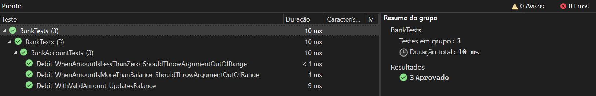

# ponderada_prog_S3_M9

### Tecnologia e Ferramentas Utilizadas

- **Linguagem de Programação:** C#
- **Framework de Testes de Unidade:** MSTest
- **Ambiente de Desenvolvimento:** Visual Studio

### Introdução

O tutorial abordou a criação e execução de testes de unidade em C# usando o framework MSTest no ambiente de desenvolvimento Visual Studio. O objetivo principal foi demonstrar a importância dos testes de unidade na garantia da qualidade do código e na detecção de possíveis bugs.

### Conceitos Aprendidos

1. **Estrutura de Testes de Unidade MSTest:**
   - Aprendemos a estrutura básica dos testes de unidade MSTest, incluindo a criação de classes de teste decoradas com atributos como `[TestClass]` e `[TestMethod]`.

2. **Uso de Asserts:**
   - Compreendemos o uso de métodos de assert, como `Assert.AreEqual`, para verificar se os resultados dos testes correspondem aos resultados esperados.

3. **Configuração de Projetos de Teste:**
   - Aprendemos a configurar projetos de teste de unidade, adicionar referências a projetos principais e executar testes no Gerenciador de Testes do Visual Studio.

4. **Tratamento de Exceções em Testes:**
   - Exploramos como tratar exceções em testes de unidade, garantindo que certas exceções sejam lançadas quando esperado.

5. **Refatoração de Código de Produção:**
   - Aprendemos a refatorar o código de produção para torná-lo mais robusto, informativo e alinhado com as melhores práticas de teste.

### Execução dos Testes

A execução dos testes foi realizada utilizando o Gerenciador de Testes do Visual Studio. Abaixo estão alguns prints demonstrando a execução dos testes:

1. **Teste de Débito com Valor Válido:**

2.  **Teste de Débito com Valor Menor que Zero (Exceção Esperada):**
   
3. **Teste de Débito com Valor Maior que Saldo (Exceção Esperada):**
   
### Conclusão

O tutorial forneceu uma compreensão prática sobre a importância dos testes de unidade no desenvolvimento de software em C# usando MSTest. A capacidade de criar testes robustos e informativos não apenas melhora a qualidade do código, mas também facilita a manutenção e identificação precoce de problemas.

### Referências

- [Passo a passo](https://learn.microsoft.com/pt-br/visualstudio/test/walkthrough-creating-and-running-unit-tests-for-managed-code?view=vs-2022)
- [Documentação do MSTest](https://docs.microsoft.com/pt-br/dotnet/core/testing/unit-testing-with-mstest)
- [Documentação do Visual Studio - Testes de Unidade](https://docs.microsoft.com/pt-br/visualstudio/test/unit-test-basics?view=vs-2022)
